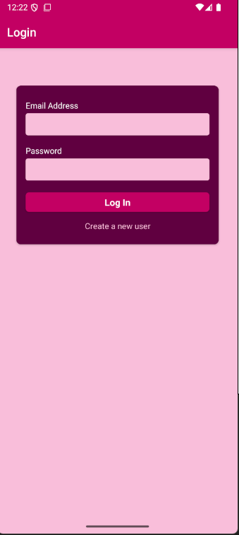
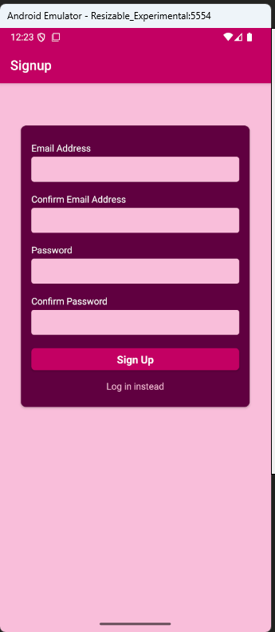
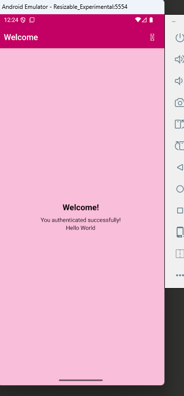

# React Native Authentication App

A complete React Native authentication application with email/password authentication using Firebase Authentication. This app includes user registration, login, logout, and persistent authentication using AsyncStorage.

## Features

- ✅ User Registration (Sign Up)
- ✅ User Login
- ✅ Persistent Authentication (Auto-login on app restart)
- ✅ Logout Functionality
- ✅ Protected Routes
- ✅ Form Validation
- ✅ Loading States
- ✅ Error Handling
- ✅ Secure Token Storage

## Screenshots

<div align="center">
  
  
  
</div>

## Tech Stack

- **React Native** (0.82.1)
- **React Navigation** (v7) - Navigation stack
- **Firebase Authentication** - Backend authentication service
- **Axios** - HTTP requests
- **AsyncStorage** - Persistent token storage
- **React Context API** - Global state management

## Prerequisites

Before running this project, make sure you have the following installed:

- Node.js (>= 20)
- npm or yarn
- React Native development environment
  - For iOS: Xcode (macOS only)
  - For Android: Android Studio and JDK
- Firebase project with Authentication enabled

## Installation

1. **Clone the repository**
   ```bash
   git clone <your-repo-url>
   cd AuthenticationApp
   ```

2. **Install dependencies**
   ```bash
   npm install
   # or
   yarn install
   ```

3. **Set up Firebase**
   - Create a Firebase project at [Firebase Console](https://console.firebase.google.com/)
   - Enable Email/Password authentication in Authentication section
   - Copy your Firebase API key
   - Replace the API key in `src/util/auth.js`:
     ```javascript
     const API_KEY = 'YOUR_FIREBASE_API_KEY';
     ```

4. **iOS Setup** (macOS only)
   ```bash
   cd ios
   pod install
   cd ..
   ```

## Running the App

### Android
```bash
npm run android
# or
yarn android
```

### iOS
```bash
npm run ios
# or
yarn ios
```

### Start Metro Bundler
```bash
npm start
# or
yarn start
```

## Project Structure

```
AuthenticationApp/
├── src/
│   ├── components/
│   │   ├── Auth/
│   │   │   ├── AuthContent.js      # Main auth UI container
│   │   │   ├── AuthForm.js         # Form with inputs
│   │   │   └── Input.js            # Reusable input component
│   │   └── ui/
│   │       ├── Button.js           # Primary button
│   │       ├── FlatButton.js       # Text button
│   │       ├── IconButton.js       # Icon button
│   │       └── LoadingOverlay.js   # Loading spinner
│   ├── screens/
│   │   ├── LoginScreen.js          # Login screen
│   │   ├── SignupScreen.js         # Registration screen
│   │   └── WelcomeScreen.js        # Protected home screen
│   ├── store/
│   │   └── auth-context.js         # Authentication context
│   ├── util/
│   │   └── auth.js                 # Firebase API calls
│   └── constants/
│       └── styles.js               # Color constants
├── assets/
│   ├── login.png                   # Login screen screenshot
│   ├── newUser.png                 # Sign up screen screenshot
│   └── home.png                    # Home screen screenshot
├── App.js                          # Root component with navigation
├── package.json
└── README.md
```

## How It Works

### Authentication Flow

1. **First Launch**
   - App checks AsyncStorage for existing token
   - If no token found → Shows Login/Signup screens
   - If token found → Auto-authenticates and shows Welcome screen

2. **Sign Up**
   - User enters email and password (with confirmation)
   - Form validates inputs (email format, password length > 6)
   - Sends request to Firebase Authentication
   - Receives ID token
   - Stores token in Context and AsyncStorage
   - Navigates to Welcome screen

3. **Login**
   - User enters credentials
   - Validates and sends to Firebase
   - Stores token
   - Navigates to Welcome screen

4. **Logout**
   - Clears token from Context
   - Removes token from AsyncStorage
   - Navigates back to Login screen

### State Management

The app uses React Context API for global authentication state:

```javascript
AuthContext provides:
- token: Current auth token
- isAuthenticated: Boolean authentication status
- authenticate(token): Store token and mark as authenticated
- logout(): Clear token and mark as unauthenticated
```

### Navigation Structure

```
Root
├── AuthStack (Unauthenticated)
│   ├── Login
│   └── Signup
└── AuthenticatedStack (Authenticated)
    └── Welcome
```

## API Configuration

### Firebase Authentication Endpoints

The app uses Firebase REST API:

- **Sign Up**: `https://identitytoolkit.googleapis.com/v1/accounts:signUp`
- **Login**: `https://identitytoolkit.googleapis.com/v1/accounts:signInWithPassword`

### Example Request
```javascript
{
  email: "user@example.com",
  password: "password123",
  returnSecureToken: true
}
```

### Example Response
```javascript
{
  idToken: "eyJhbGciOiJSUzI1NiIsImtpZCI6...",
  email: "user@example.com",
  refreshToken: "...",
  expiresIn: "3600",
  localId: "..."
}
```

## Validation Rules

### Email Validation
- Must contain '@' symbol
- Trimmed of whitespace

### Password Validation
- Minimum 6 characters
- Trimmed of whitespace

### Sign Up Additional Validation
- Email and Confirm Email must match
- Password and Confirm Password must match

## Error Handling

The app handles:
- Invalid credentials
- Network errors
- Firebase authentication errors
- Form validation errors

Errors are displayed using React Native's `Alert` component.

## Troubleshooting

### Testing Credentials
Use the following credentials to test the app:
- **Email**: `raj@gmail.com`
- **Password**: `12345678`

### iOS Build Issues
```bash
cd ios
pod deintegrate
pod install
cd ..
```

### Android Build Issues
```bash
cd android
./gradlew clean
cd ..
npm start -- --reset-cache
```

### Metro Bundler Issues
```bash
npm start -- --reset-cache
```

### AsyncStorage Issues
```bash
# iOS
cd ios && pod install
# Android - Usually works out of the box
```

## Testing

To test the authentication flow:

1. **Sign Up**
   - Enter email: `raj@gmail.com`
   - Enter password: `12345678`
   - Confirm both fields
   - Press "Sign Up"

2. **Logout**
   - Press exit icon in header

3. **Login**
   - Use same credentials
   - Press "Log In"

4. **Persistent Auth**
   - Close and reopen the app
   - Should auto-login to Welcome screen

## Resources

- [React Native Documentation](https://reactnative.dev/)
- [React Navigation Documentation](https://reactnavigation.org/)
- [Firebase Authentication Documentation](https://firebase.google.com/docs/auth)
- [AsyncStorage Documentation](https://react-native-async-storage.github.io/async-storage/)

